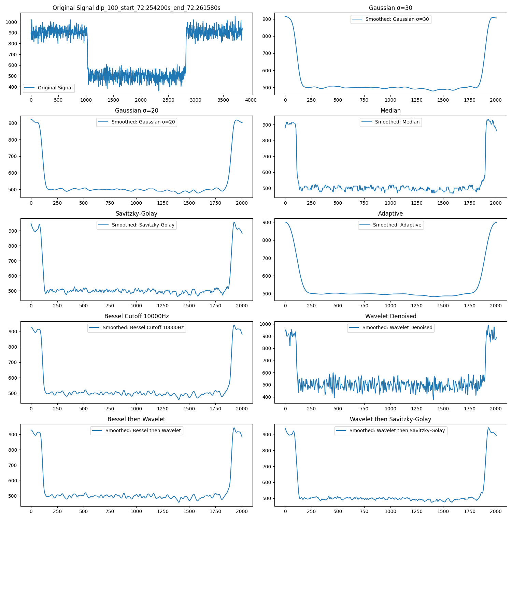
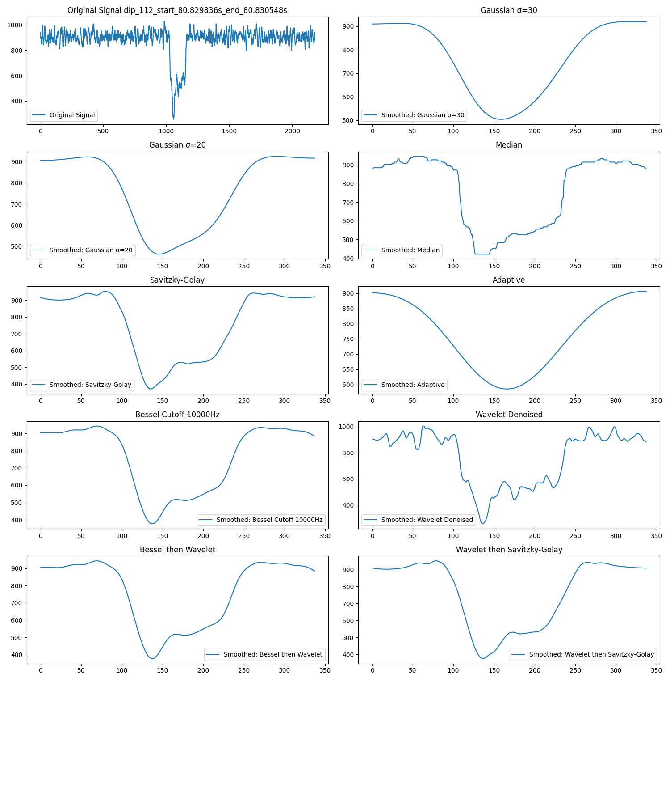

# Translocating Event Analysis of Nanopore

## Description

This repository facilitates the analysis of raw data in the .abf format, with a focus on studying translocating events through nanopores. It provides comprehensive signal analysis capabilities, including:

1. **Identification of Translocating Events:** Automatic detection of events within raw data.
2. **Deep Analysis of Signals:** Application of various smoothing techniques for detailed signal analysis.
3. **Clustering:** Employment of k-means or hierarchical clustering to group events, determine the optimal number of clusters, and more. Future updates will introduce additional clustering methods.
4. **Similar Signal Retrieval:** Identification of signals that share similarities within the dataset.
5. **ML-Based Classification:** An upcoming feature for classifying signals using machine learning methodologies.

## Installation

### Requirements

Ensure Python (version 3.8 or newer) is installed on your system. This project's dependencies can be installed via:

```sh
pip install -r requirements.txt
```

### Setting Up

Clone this repository to begin:

```sh
git clone https://github.com/yourusername/translocating-event-analysis.git
cd translocating-event-analysis
```

## Usage

The repository's features can be accessed as described below:

### Identifying Events and Analysis

To identify translocating events, perform deep signal analysis, and generate plots, execute the following script:

```sh
bash find_and_analyze.sh
```

The analysis behavior can be customized by modifying the `configs/event-analysis.yaml` configuration file. This file contains important parameters that control various aspects of the analysis, including paths to data files, smoothing techniques parameters, and versioning for output directories. Update the configuration file according to your specific requirements before running the analysis scripts.

Example configuration parameters include:

- `version`: Specifies the version of the analysis, affecting output directory naming.
- `data_file_path`: The path to the raw .abf data file for analysis.
- `sampling_rate`, `base_sigma`, `gaussian_sigma`, etc.: Parameters that control the data processing and analysis techniques.

### Sample Outputs

The following are examples of outputs generated by the analysis scripts. Ensure the images are available in your repository or hosted online to be viewable in the README.

- **Static Plot Example 1:**  
  
  
- **Static Plot Example 2:**  
  

### Interactive HTML Visualizations

For an interactive analysis experience, the repository generates HTML files that can be viewed in any modern web browser. To view these interactive visualizations, download the HTML files from the following paths within the repository, and open them in your browser:

- **Interactive Visualization Example 1:** `plots/dips_plots_07_0s_300s_soft/0s-300s/dip_100_start_72.254200s_end_72.261580s.html`
- **Interactive Visualization Example 2:** `plots/dips_plots_07_0s_300s_soft/0s-300s/dip_112_start_80.829836s_end_80.830548s.html`

Simply click on the links to navigate to the files in GitHub, then use the "Download" or "Raw" options to save them to your computer. Once downloaded, open the files with your web browser to explore the data interactively.


### Finding Optimal Cluster Size

To find the optimal cluster size in your data:

```sh
python some_script.py
```

### Clustering with K-Means or Hierarchical Methods

For applying hierarchical and k-means clustering:

```sh
python some_script.py
```

### Retrieving Similar Events

To find similar translocating events within the dataset:

```sh
python some_script.py
```

## Contributing

Contributions are welcome! If you have suggestions for improvements or new features, feel free to fork this repository, make your changes, and submit a pull request.

## License

[MIT License](LICENSE.txt)
